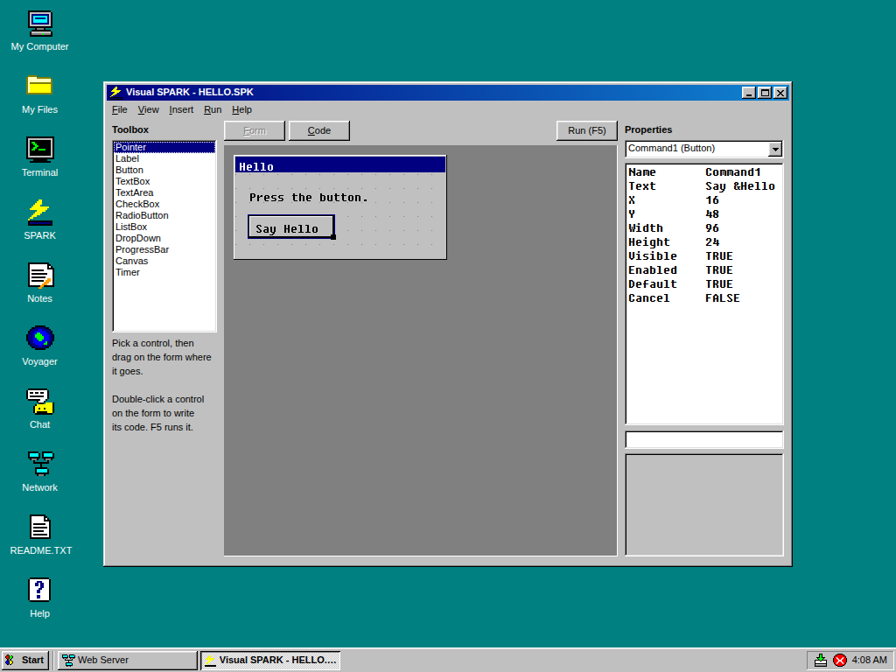

# Visual SPARK

Build SIM95 programs the Visual BASIC way: draw the window, double-click
what's on it, and write what happens. **F5** runs it.



## The window

* **Toolbox** (left): pick a control, then drag on the form where it goes,
  or double-click a control to drop one on the form. The controls are Label,
  Button, TextBox, TextArea, CheckBox, RadioButton, ListBox, DropDown,
  ProgressBar, Canvas and Timer. A Timer shows as a clock on the form and is
  invisible when the program runs, as in VB.
* **Designer** (middle): the form, drawn in Win95 style on an 8-pixel grid.
  * Click to select a control, drag to move it, and drag its corner handle to
    size it. The form's own corner handle sizes the form.
  * To remove the selected control: press **Delete**, click **Delete** by the
    Properties list, choose **Edit > Delete Control**, or right-click it and
    choose **Delete**.
  * The arrow keys move the selected control; **Shift** with an arrow sizes it.
  * **Right-click** a control for its menu: View Code, Cut, Copy, Paste,
    Duplicate, Delete, Bring to Front and Send to Back. Right-click the form
    for View Code, Paste and the Menu Editor.
* **Edit menu**, for the form:
  * **Undo** (Ctrl+Z) and **Redo** (Ctrl+Y) cover everything done on the
    form, its properties and its menus. Undoing a rename puts the code back
    too, unless the code has been edited since; the code window has its own
    undo.
  * **Cut, Copy, Paste** (Ctrl+X, C, V) and **Duplicate** (Ctrl+D): a pasted
    control lands a little down and to the right, with a name of its own.
    Its code isn't copied.
  * **Bring to Front** and **Send to Back**: which controls are drawn over
    which.
  * **Double-click** a control to go to its usual event's code.
* **Properties** (right): pick the object at the top, then a property; type
  its value and press **Enter**.
  * Double-clicking a TRUE/FALSE flips it; double-clicking a choice (like
    `Align`) moves to the next one.
  * Lists take their items with `;` between them: `Black;Red;Green`.
  * The help box underneath explains the selected property.
  * **Anchor**, on every control, is the window edges it keeps its distance
    to when the window is resized, as in Windows Forms:
    * `Top,Left`, the usual, stays put;
    * `Bottom,Right` follows the bottom right corner, as OK and Cancel
      buttons do;
    * `Top,Bottom,Left,Right` stretches with the window, as a text area
      filling it does;
    * with neither Left nor Right (or neither Top nor Bottom) it stays in
      the middle.

    Double-clicking Anchor goes through the usual ones. Resizing the form on
    the designer moves anchored controls the same way.
* **Code** (the Code button, or **F7**): your program, with SPARK syntax
  colouring.
  * Two drop-downs, as in VB: an object, then one of its events.
  * Picking an event goes to its SUB, writing it from a template if it isn't
    there yet. For example, picking Command1's `onClick` writes:

    ```
    SUB Command1_OnClick ()
        ' when Command1 is clicked. For example:
        ' Form1.Title = "Clicked!"
    END SUB
    ```

  * Events that already have code say "(code)" in the list.
  * The form's **Load** event is `SUB Main`.
* **Insert menu:** ready-made pieces of code, put in at the cursor:
  * a message box;
  * a yes-or-no question;
  * open a file, and save a file (both with the file dialog);
  * a random number;
  * run another program.
* **Layout (F8):** the form as text, as Visual BASIC kept it in a `.FRM` file:
  a `Begin Button Command1` ... `End` for each object, with every property.

  ```
  Begin Button Command1
      Text = "&Greet"
      X = 16
      Y = 80
      ...
      Anchor = "Bottom,Right"
  End
  ```

  Change values, add or remove objects, or put them in another order (later
  ones are drawn on top), then go back to the Form or the Code:
  * the changes are applied, and can be undone;
  * renaming an object on its Begin line renames its code too;
  * a mistake isn't applied: a message says which line is wrong and why,
    and the cursor goes there.
* **Tools > Menu Editor (Ctrl+E):** the window's menus, as in VB.
  * Type a **Caption** (`&File`) and press Enter for the next one.
  * **>** puts an item in the menu above it, and **<** makes it a menu on
    the bar of its own. **Up** and **Down** move it.
  * A caption of `-` is a line between items.
  * Each item has a **Name** for the code, made from its caption
    (`mnuFileOpen`) until you type one. It also has a **Shortcut**, and
    **Checked** and **Enabled** boxes.
  * The menus appear on the form. Click a menu there and choose an item to
    write what it does: `SUB mnuFileOpen_OnClick ()`.
  * Menu items are in the Properties list too, so they can be changed there.
* **Run (F5):** saves the project and runs it. A run still going is ended
  first; **Run > End** stops it. Compile and runtime errors appear in their
  own window, as for any SPARK program.

## New Project

**File > New Project** starts from a template:

| Template | What it is |
|---|---|
| Empty form | An empty form |
| Hello, world | A label, and a button that changes it |
| Counter | A timer that counts the seconds, and a button to start again |
| Paint | A canvas to draw on with the mouse, in four colours |
| Chat client | Talks to any machine's Chat service, in `#general` |
| Vapor game | Catch the falling stars. The first line is a Vapor header, so it can be published in a store |

## Projects are ordinary programs

A project is one `.SPK` file, and it runs without Visual SPARK. Keep
projects in `C:\MYFILES`.

* **Your code comes first.**
* **The form comes last,** between two marker lines. Visual SPARK writes
  this part every time it saves:

```
' ===== Visual SPARK form: the designer writes everything from here to END OF FORM. =====
' FORM Form|Name=Form1|Title=Greeter|Width=240|Height=120|...
' CTRL Button|Name=Command1|Text=&Greet|X=16|Y=80|Width=80|Height=24|...
VAR Form1 AS GUI_Window
VAR Command1 AS GUI_Button

SUB InitForm ()
    Form1 = GUI_Window.New("Greeter", 240, 120)
    Command1 = GUI_Button.New(Form1)
    Command1.SetBounds(16, 80, 80, 24)
    Command1.Text = "&Greet"
    Command1.Default = TRUE
    Command1.onClick = Command1_OnClick
END SUB
' ===== END OF FORM =====
```

* **The comment lines** are what the designer reads back when the project
  is opened.
* **The rest** is what the program runs: `InitForm` builds the window, its
  menu bar and its controls, and `Main` calls it, then shows the form.
  * **Menus:** a menu has one event for all its items, so the designer also
    writes `MenuBar_OnSelect`, which calls each item's SUB.
  * **Anchors:** when any control is anchored other than `Top,Left`, the
    designer writes `Form1_Layout`, which places the controls again when the
    window is resized. It then calls your own `Form1_OnResize`, if you have
    one.
* **Joining events:** an event is joined to its SUB
  (`Command1.onClick = Command1_OnClick`) only when that SUB is in your code.
  Otherwise the program wouldn't compile.
* **Renaming:** renaming a control renames it in your code too: its SUBs
  and `Command1.` references, but not other words that happen to contain the
  name.
* **Deleting:** deleting a control leaves its SUBs in your code, as VB does.
  Delete them too, or the program won't compile.
* **Opening other files:** Visual SPARK opens any `.SPK`. One without a
  form gets an empty one.

## Making a Vapor game

1. **File > New Project > Vapor game.**
2. Change `id` (8 letters at most) and `name` in the first line, and the
   paths that say `MYGAME`.
3. Save the project in `C:\MYFILES` on a store's machine, then choose
   **Vapor > Publish Apps**.
4. Raise `version` each time you publish, so every Vapor offers the update.

## Installing

From any Vapor store (it's under Programming), or paste `INSTALL.SPK` into
SPARK and press F5. It writes:
* `C:\PROGRAMS\VSPARK.SPK`;
* the templates, in `C:\VSPARK\TEMPLATE`.

A project that hasn't been saved yet runs from `C:\VSPARK\RUN.SPK`.

## Not yet

* more than one form in a project;
* sub-menus (SIM95's menus have two levels);
* selecting several controls at once;
* suggestions as you type, which need the platform changes in
  `proposals/input-and-interaction.md`;
* a debugger.

Tests: `node tools/aspsim/vspark.test.mjs`. They drive the IDE as a person
would:
* drag controls onto the form, move and size them, and delete one;
* set properties;
* double-click into code;
* save, run, reopen and rename;
* insert code;
* undo and redo, copy and paste, and front and back;
* make menus in the Menu Editor, write their code and use them in the program;
* anchor controls and resize the program's window;
* edit the layout as text, mistakes included;
* build and run every template.
